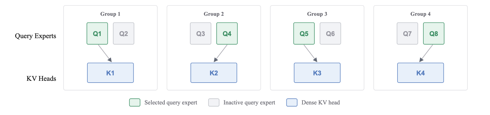

# GQE: Grouped Query Experts

Official PyTorch implementation of our paper:

**[Grouped Query Experts: Mixture-of-Experts on GQA Self-Attention](https://arxiv.org/abs/2606.20945)**

[Vishesh Tripathi](https://github.com/FrontiersMindAI), [Abhay Kumar](https://www.linkedin.com/in/akanyaani/)

FrontiersMind

[Paper](https://arxiv.org/abs/2606.20945)

---

## 🚀 Installation

```bash
pip install git+https://github.com/FrontiersMindAI/GQE.git
```

With PyTorch Lightning support:

```bash
pip install "git+https://github.com/FrontiersMindAI/GQE.git#egg=gqe[lightning]"
```

## 🧠 Algorithm Overview

Grouped Query Experts (GQE) is a mixture-of-experts layer on top of grouped-query attention (GQA). Within each GQA group, a router selects **k query-head experts per token** while all key–value (KV) heads remain dense and unchanged. This preserves GQA’s KV-cache benefits and reduces only the active query-head computation.

The default configuration matches the paper’s main setting:

- Softmax over experts **inside each GQA group**, then top-k selection
- Hard concatenation of the selected expert outputs (unscaled)
- A **renormalized weighted-sum slot** so the language-modeling loss trains the router
- An **always-on shared query head** that anchors training
- A Switch-style **load-balancing auxiliary loss**

At the 250M-parameter scale with a 30B-token budget, GQE matches the all-active GQA baseline while activating half of the routed query-head experts, computing 9 of 16 query-attention heads once the shared head is included, and reaching **1.7–1.8×** prefill speedup at long context lengths.



## 📚 Usage

### PyTorch

```python
from gqe import GQEAttention, collect_aux_loss

attn = GQEAttention(
    dim=768,
    num_query_experts=16,  # N
    num_kv_heads=8,        # G
    top_k=1,               # k
)

y = attn(x)
loss = lm_loss + 0.01 * collect_aux_loss(attn)
loss.backward()
```

### PyTorch Lightning

```python
from lightning import Trainer
from gqe import GQELightningCallback

trainer = Trainer(
    callbacks=[GQELightningCallback(aux_loss_coef=0.01)]
)
trainer.fit(model, dataloader)
```

The callback injects the load-balancing auxiliary loss before `loss.backward()`. If you already add `collect_aux_loss` in `training_step`, set `inject_aux_loss=False`.

---

## 🔍 Parameters

These match the paper’s GQE setup. In the main experiment, `N=16`, `G=8`, `k=1`.

| Argument | Description | Default |
|---|---|---|
| `dim` | Hidden size `d`. | required |
| `num_query_experts` | Routed query-head experts `N`. Must be divisible by `num_kv_heads`. | `16` |
| `num_kv_heads` | GQA groups / dense KV heads `G`. | `8` |
| `top_k` | Experts activated per group `k`. | `1` |
| `head_dim` | Per-head dimension `d_h`. Defaults to `dim // num_query_experts`. | `None` |
| `variant` | Output construction. `"gqe"` is the full method. `"hard_concat"` and `"weighted_concat"` are the Table 2 ablations. | `"gqe"` |

`GQELightningCallback` takes `aux_loss_coef` (default `0.01`) for the load-balancing loss.

---

## Ablations

Sparse query-head routing matches dense GQA only with renormalized scoring and a shared head. `variant` reproduces Table 2:

```python
GQEAttention(..., variant="weighted_concat")  # no renormalized slot
GQEAttention(..., variant="hard_concat")      # hard concat only
GQEAttention(..., variant="gqe")              # full method
```

---

## Testing

```bash
./run_tests.sh
./run_tests.sh lightning
```

---

## Citation

```bibtex
@misc{tripathi2026gqe,
      title={Grouped Query Experts: Mixture-of-Experts on GQA Self-Attention},
      author={Vishesh Tripathi and Abhay Kumar},
      year={2026},
      eprint={2606.20945},
      archivePrefix={arXiv},
      primaryClass={cs.LG},
      url={https://arxiv.org/abs/2606.20945},
}
```

---

## 📜 License

Apache-2.0 license
